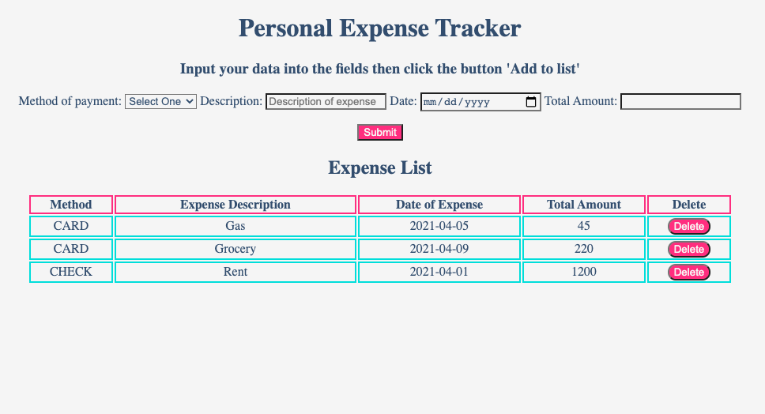

# Expense-Tracker
An app to help you keep track of your expenditures built with Javascript, HTML and CSS

## Try it
Use the expense tracker [here](https://dmalchowlfc.github.io/Expense-Tracker/)

## App Screenshot

## Summary
This is my fourth application in the Mastermind Program and has helped me to push my boundaries once again. While similar to the to-do list, this incorporated building a table and multiple inputs of data simultaneously, which at first was a bit of a challenge. This was the first time I've utilized the .target method. Once I grasped the concept of this, I feel like its opened up ideas onto so many more possibilities with code. 

## Author
David Malchow - [LinkedIn](https://www.linkedin.com/in/david-malchow-809b106b/)
